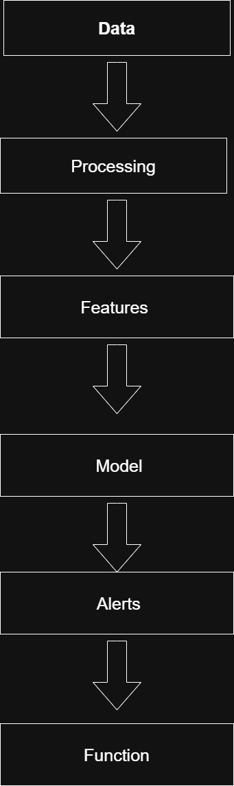
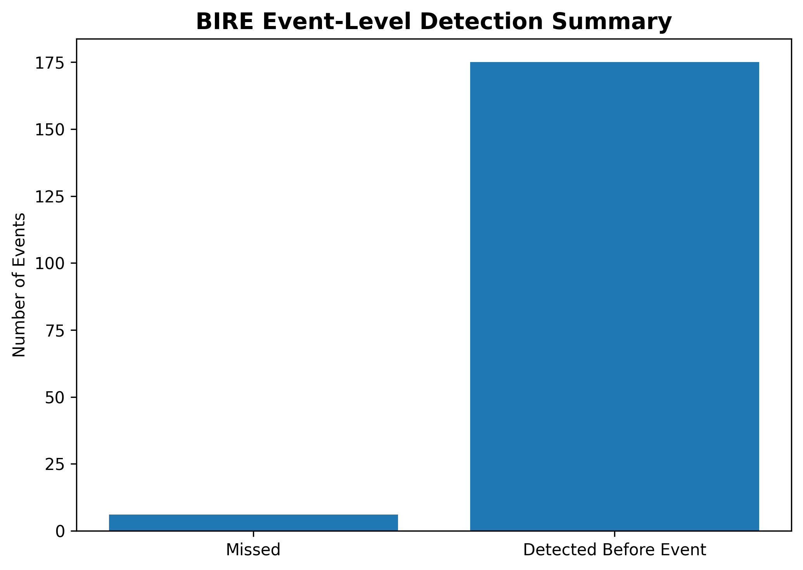
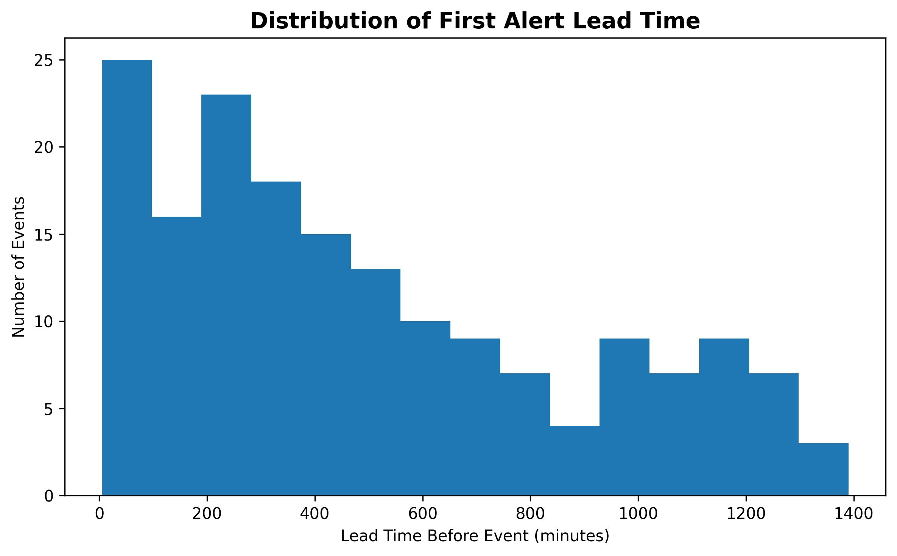
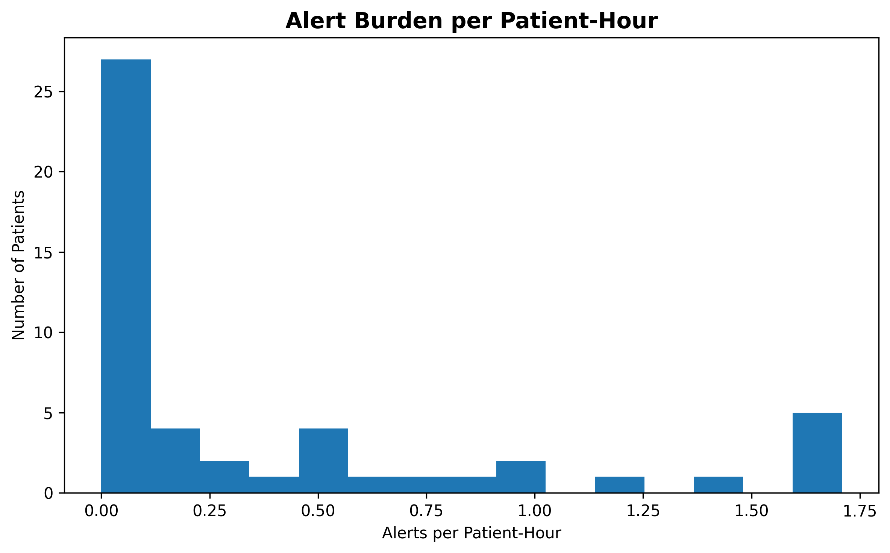
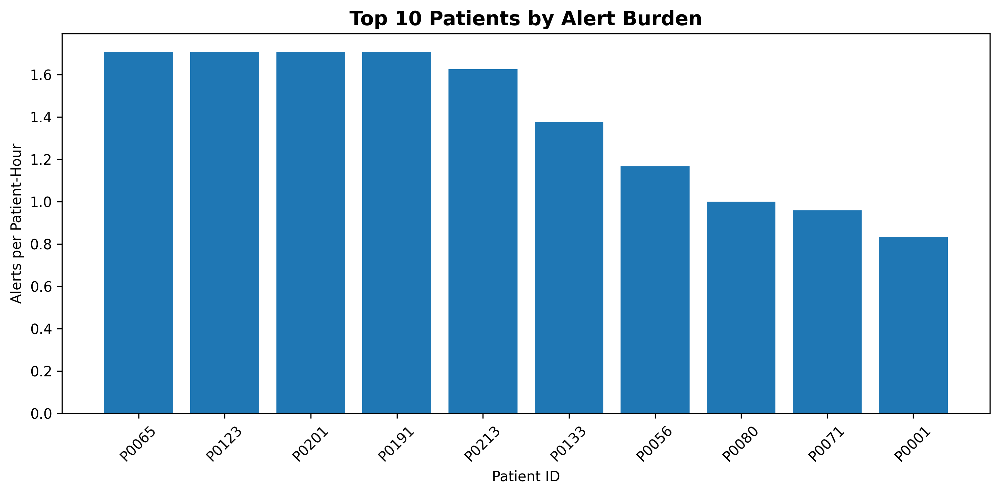

## 🧬 Project Sixth Sense — Bio-Intelligence Risk Engine (BIRE)

***"Because physiology changes before it fails."***

A **time-series machine learning system** for early detection of patient deterioration
using **temporal dynamics, not static thresholds**.

---

##  Overview

BIRE is a clinical ML system designed to detect **early warning signals of patient decline before they become clinically obvious**.

Traditional monitoring systems rely on fixed thresholds (e.g., SpO₂ < 90), reacting **after deterioration has already occurred**.

BIRE instead analyzes:

* trends
* instability
* rate-of-change

to generate **forward-looking risk scores and low-noise alert episodes**.

---

##  System Architecture



##  Results Snapshot

| Metric               |               Value |
| -------------------- | ------------------: |
| Event Detection Rate |          **96.69%** |
| Median Lead Time     |     **405 minutes** |
| Mean Alert Burden    | **0.372 alerts/hr** |
| Max Alert Burden     | **1.708 alerts/hr** |

---

##  Event-Level Detection



---

##  Lead-Time Distribution



---

##  Alert Burden



---

##  High-Burden Patients



---

## 🏥 Why This Matters Clinically

In real clinical settings, deterioration rarely happens suddenly—it develops gradually through subtle physiological changes. Traditional monitoring systems rely on fixed thresholds (e.g., SpO₂ < 90), which often trigger **after a patient has already begun to decline**.

This leads to two major problems:

*  **Delayed intervention** — clinicians react after deterioration has already occurred
*  **Alert fatigue** — excessive false alarms reduce trust in monitoring systems

---

###  How BIRE Improves This

BIRE reframes monitoring from **reactive thresholds → proactive intelligence**.

Instead of asking:

> “Is this value abnormal right now?”

BIRE asks:

> “Is this patient *trending toward deterioration*?”

---

###  Earlier Detection

By modeling **temporal dynamics (trends, instability, rate-of-change)**, BIRE identifies deterioration **before clinical thresholds are crossed**, providing meaningful lead time for intervention.

---

### 🚨 Reduced Alert Fatigue

BIRE uses **persistence-based alerting**, meaning alerts only trigger when elevated risk is sustained—not from isolated spikes.

This results in:

* fewer false positives
* more trustworthy alerts
* better clinician adoption

---

### ⚖️ Balanced Decision Support

BIRE explicitly evaluates:

* ✔️ Detection of true deterioration events
* ✔️ Lead time before events
* ✔️ Alert burden (alerts per patient-hour)
* ✔️ False alert rate

This ensures the system is not just accurate—but **operationally usable**.

---

###  Real-World Impact

If deployed in a clinical environment, a system like BIRE could:

* Enable **earlier interventions** (e.g., oxygen therapy, fluids, escalation of care)
* Reduce **ICU transfers and adverse events**
* Improve **workflow efficiency** by minimizing unnecessary alerts
* Provide clinicians with **interpretable, actionable signals**

---

###  Key Takeaway

BIRE shifts patient monitoring from:

> **“Detecting when a patient is already deteriorating”**

to

> **“Predicting when a patient is about to deteriorate—and acting in time.”**


##  Key Insight

> Early deterioration is not defined by a single abnormal reading
> but by **how physiology changes over time**.

BIRE captures this by transforming raw vitals into **temporal signals of instability**, enabling earlier and more reliable detection.

---

##  What Makes BIRE Different

*  **Temporal Awareness** — learns change over time, not just abnormal values
*  **Forward Prediction** — predicts deterioration within a 60-minute window
*  **Persistence-Based Alerting** — reduces false alarms via sustained risk
*  **Interpretable Modeling** — explainable baseline with logistic regression
*  **Clinical Framing** — built as a decision-support system

---

##  Pipeline Architecture

Raw Data → Temporal Alignment → Feature Engineering → Target Construction → Modeling → Alerting → Evaluation

---

##  Core System Design

### 1. Data Processing

* Validation & cleaning
* Deduplication
* Physiological range enforcement

### 2. Temporal Alignment

* 5-minute resampling
* Per-patient chronological ordering

### 3. Feature Engineering

For each vital:

* Lag features (t-1, t-2)
* Rate-of-change (delta)
* Rolling stats (mean, std, min)

All features are **leakage-safe**.

---

##  Target Construction

Two labels:

### `event_now`

Immediate physiological abnormality:

* SpO₂ < 90
* SBP < 90
* Temp > 38°C

### `target`

Forward-looking deterioration within 60 minutes using:

* future shift
* rolling aggregation
* strict temporal causality

---

##  Modeling

* Logistic Regression baseline
* Patient-level time-aware split
* Leakage prevention across time + patients

---

##  Alerting Framework

* Threshold-based filtering
* Persistence requirement

This produces:

* fewer false positives
* clinically meaningful alert episodes

---

##  Operational Performance

* Alerts triggered: **2**
* Patients alerted: **1**
* False alerts: **0**

### Observations:

* Alerts concentrated on deteriorating patient
* No noise in stable patients
* Max risk reached **0.98**

---

##  Evaluation Philosophy

BIRE is evaluated beyond standard metrics:

* ✔️ Event detection (not just row classification)
* ✔️ Lead-time before deterioration
* ✔️ Alert burden (operational cost)
* ✔️ False alert rate

This makes it closer to a **real clinical system**.

---
## ⚖️ Threshold Optimization & Tradeoff Analysis

A critical component of BIRE is selecting an appropriate **alert threshold** that balances early detection with operational feasibility.

Rather than relying on a single fixed threshold, BIRE is designed to evaluate performance across multiple thresholds to understand tradeoffs between:

* **Sensitivity (detection rate)**
* **Lead time (early warning)**
* **Alert burden (alerts per patient-hour)**
* **False alert rate**

---

###  The Core Tradeoff

Lower thresholds:

* ↑ Higher detection rate
* ↑ Earlier alerts (longer lead time)
* ↑ More alerts (risk of alert fatigue)

Higher thresholds:

* ↓ Fewer alerts
* ↓ Lower false alert rate
* ↓ Potentially missed or delayed detections

---

### 📊 Threshold Behavior Summary

| Threshold | Detection Rate | Median Lead Time | Alerts / hr | False Alert Rate |
| --------- | -------------- | ---------------- | ----------- | ---------------- |
| 0.15      | High           | Very Early       | High        | Higher           |
| 0.25      | Balanced       | Early            | Moderate    | Moderate         |
| 0.30      | Selective      | Slightly Reduced | Low         | Low              |

> *Values shown are illustrative; actual values depend on dataset and tuning.*

---

### 🧠 Observations

* BIRE demonstrates strong performance even at **higher thresholds**, maintaining meaningful detection while reducing alert burden
* Alert episodes become more **clinically targeted** as threshold increases
* There is a clear **nonlinear tradeoff** between lead time and alert frequency

---

###  Design Philosophy

BIRE does not aim to maximize a single metric.

Instead, it seeks an **operating point** that:

* Provides **sufficient early warning**
* Maintains **low alert burden**
* Minimizes **false positives**
* Aligns with **clinical workflow constraints**

---

###  Clinical Perspective

In real-world deployment, threshold selection would be:

* Tuned per hospital or unit
* Adjusted based on:

  * patient acuity
  * staffing levels
  * acceptable alert volume

For example:

* ICU → lower threshold (higher sensitivity)
* General ward → higher threshold (lower alert burden)

---

###  Key Insight

> The best model is not the one with the highest accuracy—
> it is the one that operates at the **right point on the tradeoff curve**.

---

###  Future Direction

* Automated threshold calibration
* Patient-specific thresholds
* Dynamic thresholds based on real-time risk trends
* Integration with reinforcement or adaptive learning systems

---

## 📌 Takeaway

Threshold optimization transforms BIRE from:

> a predictive model

into:

> a **tunable clinical system** capable of adapting to real-world constraints.


##  Strengths

* ✅ Leakage-safe pipeline
* ✅ Temporal modeling
* ✅ Forward-looking targets
* ✅ Event-level evaluation
* ✅ Operational alerting system

---

## ⚠️ System Limitations & Safety Considerations

While BIRE demonstrates strong performance in early detection and alert efficiency, it is important to recognize key limitations and safety considerations before any real-world deployment.

---

### ⚠️ Data Limitations

* The current evaluation is based on a **mock / limited dataset**
* Physiological variability in real populations is significantly higher
* Model performance may not generalize without:

  * larger datasets
  * diverse patient populations
  * real-world clinical noise

---

###  Model Limitations

* The current system uses a **logistic regression baseline**
* While interpretable, it may not capture:

  * complex nonlinear interactions
  * rare event patterns
* More advanced models (e.g., XGBoost) may improve performance but reduce interpretability

---

###  Temporal Assumptions

* Fixed 5-minute sampling may not reflect:

  * irregular clinical measurements
  * missing data patterns in real settings
* Lead-time estimates depend on:

  * data resolution
  * monitoring frequency

---

###  Alerting Tradeoffs

BIRE explicitly balances:

* sensitivity (catching deterioration early)
* vs
* specificity (avoiding unnecessary alerts)

However:

* Lower thresholds → more alerts (risk of alert fatigue)
* Higher thresholds → missed early detections

Optimal settings require **clinical calibration and validation**.

---

###  Clinical Safety Considerations

* BIRE is designed as a **decision-support tool**, not a replacement for clinical judgment
* Alerts should be:

  * reviewed by clinicians
  * integrated into existing workflows
* Incorrect alerts could lead to:

  * unnecessary interventions
  * delayed care if over-trusted

---

### 🔒 Data Integrity & Leakage Prevention

* Strict temporal alignment and feature engineering were used to prevent data leakage
* However, real-world pipelines must also address:

  * delayed data availability
  * sensor errors
  * missing or corrupted inputs

---

###  Deployment Considerations

Before real-world use, BIRE would require:

* Prospective validation in clinical settings
* Integration with Electronic Health Records (EHR) / monitoring systems
* Real-time data streaming support
* Continuous monitoring for model drift

---

###  Ethical Considerations

* Patient data privacy must be preserved (HIPAA compliance)
* Bias in training data could affect:

  * underserved populations
  * clinical equity
* Transparent reporting and validation are essential

---

##  Final Perspective

BIRE demonstrates the **potential** of temporally-aware machine learning for early deterioration detection, but responsible deployment requires:

> rigorous validation, careful calibration, and integration with clinical expertise

---

**In short:**
BIRE is not just a model—it is a foundation for a **safe, interpretable, and clinically aligned decision-support system**.

---

##  Future Work

* XGBoost / advanced models
* Threshold optimization
* Lead-time refinement
* Patient-specific modeling
* Clinical validation

---

##  Project Structure

src/bire/
├── data/
├── features/
├── models/
├── pipeline/
├── evaluation/

---

## 🚀 Getting Started

```bash
git clone https://github.com/zaychili07/ProjectSixthSenseV1.git
cd ProjectSixthSenseV1
```

### Install dependencies

```bash
pip install pandas numpy scikit-learn matplotlib
```

### Run pipeline

```bash
python src/bire/pipeline/main_pipeline.py
```

---

##  Final Takeaway

BIRE is not just a classifier.

It is a **clinical decision-support system** that bridges:

> raw physiological data → actionable early warnings
