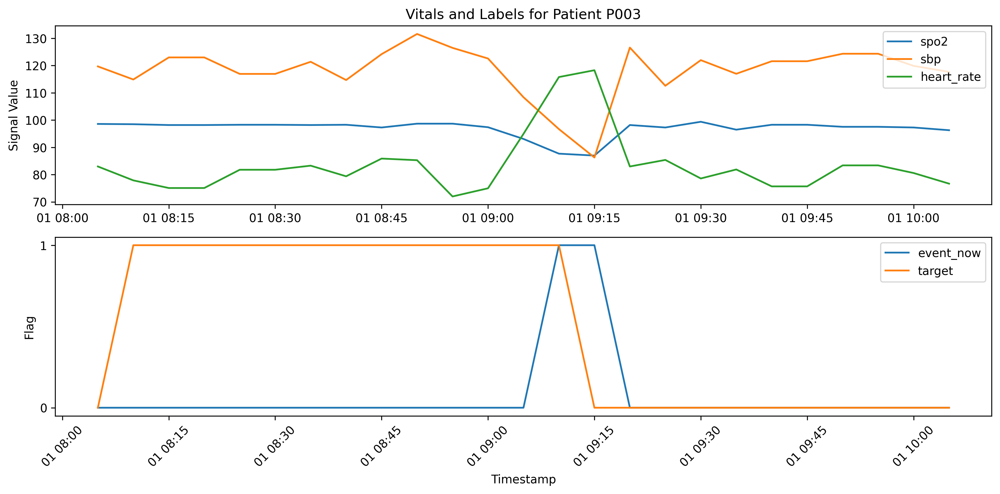

# 🧬 Project Sixth Sense – Bio-Intelligence Risk Engine (BIRE)

> **AI-powered early detection system for clinical deterioration and emerging epidemiological risk**

---

## 🚀 Overview

Project Sixth Sense – Bio-Intelligence Risk Engine (BIRE) is a modular AI system designed to detect early warning signals in patient physiology before they become clinically apparent.

By combining time-series analysis, anomaly detection, and predictive modeling, BIRE shifts healthcare monitoring from **reactive thresholds → proactive intelligence**.

---

## 🎯 Why This Matters

Traditional systems (e.g., PEWS):
- rely on static thresholds  
- ignore temporal dynamics  
- lack adaptability  

BIRE introduces:
- **temporal awareness**
- **data-driven pattern recognition**
- **multi-signal feature modeling**

> Goal: enable earlier intervention, reduce risk, and improve patient outcomes.

---

## 🧠 Technical Focus

This project sits at the intersection of:

- Time-Series Analysis  
- Machine Learning / AI  
- Anomaly Detection  
- Healthcare Data Systems  
- Feature Engineering Pipelines  

---

## ⚙️ Current Phase: Cycle I (Cycle I (Temporal Feature Engineering & Modeling Dataset Construction))

Cycle I transforms raw physiological data into a structured feature matrix for modeling.

### Key Capabilities

- 📥 **Data Ingestion**
- 🧹 **Physiological Validation**
- ⏱️ **Temporal Alignment (5-minute intervals)**
- 🧩 **Conservative Missing Data Handling**
- 📊 **Time-Series Feature Engineering**
- 🔁 **Sequence Construction for ML models**

---

## 🔬 Feature Engineering Strategy

For each physiological signal (HR, SpO₂, BP, etc.), BIRE computes:

- **Delta (rate of change)**
- **Rolling Mean**
- **Rolling Standard Deviation**
- **Rolling Min / Max**

All features are computed using **sliding windows** while preventing data leakage.

---

## 📦 Output

Cycle I produces:

- Clean aligned dataset  
- Feature-enhanced dataset  
- Sequence-ready time-series windows  

> These outputs feed directly into anomaly detection and predictive modeling layers.

---

## 🏗️ Project Structure
src/
└── bire/
├── config.py
├── data/
│ ├── ingestion.py
│ ├── preprocessing.py
│ ├── validators.py
│ ├── temporal_alignment.py
│ └── imputers.py
│
├── features/
│ └── feature_engineering.py
│
├── models/
│ ├── anomaly_detection.py
│ ├── risk_scoring.py
│ └── time_series.py
│
└── pipeline/
└── main_pipeline.py

## 🛡️ Data Leakage Prevention

Cycle I is designed with strict temporal integrity to ensure valid downstream modeling.

Key safeguards:

* All feature engineering is performed **per patient** using `groupby("patient_id")`
* Data is **sorted by timestamp** before any transformation
* Rolling statistics are computed using `.shift(1)` to ensure **only past data is used**
* No forward-filling or future-aware imputation is applied
* Feature windows strictly exclude the current prediction horizon

These constraints ensure that all features represent information **available at prediction time**, making the system suitable for real-time deployment.

## 📐 Feature Specification

Example engineered features:

* `heart_rate_lag1`, `heart_rate_lag2`
* `spo2_delta`
* `resp_rate_roll_mean_6`
* `sbp_roll_std_6`
* `temperature_roll_min_6`

Feature categories:

* **Lag Features** → capture recent history
* **Delta Features** → capture rate of change
* **Rolling Statistics** → capture trends and variability

Total feature count: ~50 columns per `(patient_id, timestamp)` row.


## ✅ Cycle I Validation

The feature pipeline has been verified for:

* Correct feature generation across all patients
* Proper temporal ordering of observations
* Absence of data leakage in rolling and lag features
* Consistent feature dimensionality across the dataset

The resulting dataset is fully prepared for supervised learning in Cycle II.

## 📊 Cycle I Output Schema

Each row in the processed dataset represents:

* `patient_id`
* `timestamp`
* Raw vital signs
* Engineered features (~50 columns)

Example:

| patient_id | timestamp | heart_rate | heart_rate_lag1 | spo2_delta | resp_rate_roll_mean_6 | ... |
| ---------- | --------- | ---------- | --------------- | ---------- | --------------------- | --- |

This structured dataset serves as the input for:

* anomaly detection models
* predictive risk scoring

## ⚙️ Cycle II: Modeling & Anomaly Detection Engine

Cycle II introduces the first **intelligence layer** of BIRE, transforming engineered features into actionable risk signals.

---

### 🎯 Objectives

* Detect early physiological deterioration
* Identify abnormal patterns in patient time-series data
* Generate continuous **risk scores** for each patient

---

### 🧠 Modeling Approach

#### 1. Supervised Risk Prediction

A binary classification model predicts the likelihood of deterioration within a defined future time window.

**Inputs:**

* Feature-engineered dataset from Cycle I

**Outputs:**

* Probability of deterioration (`risk_score ∈ [0,1]`)

**Baseline Models:**

* Logistic Regression (interpretable baseline)
* Gradient Boosting (XGBoost / LightGBM)

---

#### 2. Anomaly Detection (Unsupervised)

Captures deviations from normal physiological behavior.

**Techniques (planned):**

* Isolation Forest
* Statistical deviation scoring
* Rolling z-score thresholds

**Purpose:**

* Detect novel or rare patterns
* Complement supervised predictions

---

### 📊 Evaluation Metrics

Due to class imbalance and clinical context:

* AUROC (discrimination ability)
* AUPRC (performance on rare events)
* Recall (sensitivity to deterioration)
* Precision (false alarm control)
* F1 Score

---

### ⚠️ Validation Strategy

To ensure realistic performance:

* Data is split at the **patient level** (no leakage)
* Features use **only past information**
* Evaluation mimics real-time prediction conditions

---

### 📈 Outputs

Cycle II produces:

* `risk_score` (probability of deterioration)
* `anomaly_score` (deviation from baseline)
* Model performance metrics
* Feature importance analysis

---

### 🧩 Integration with BIRE

Cycle II connects:

Feature Engine → Risk Scoring → Response Layer (Cycle III)

This establishes the core **Inference Engine** of BIRE.

---

## Cycle II Target Validation

Below is an example patient timeline showing raw vitals alongside the forward-looking target.



### 🔄 Current Status

🔄 Model training in progress
🔄 Target definition under refinement
🔄 Baseline evaluation underway


## 🔐 Responsible Use

This project is intended for **research and educational purposes only**.

- No personally identifiable information (PII) should be used
- Only synthetic or de-identified datasets are permitted
- BIRE is a **decision-support system**, not a medical authority
- Clinical deployment requires formal validation and regulatory approval

See `POLICY.md` for full details.

---

## 🔮 Roadmap

- **Cycle II:** Anomaly Detection (unsupervised pattern deviation)
- **Cycle III:** Predictive Risk Modeling
- **Cycle IV:** Multi-Signal Fusion Engine
- **Cycle V:** Epidemiological Risk Detection

## 🧪 How to Run

```bash
python src/bire/pipeline/main_pipeline.py


## ✅ Status

Cycle I (Feature Engineering Pipeline) is fully implemented and operational.
