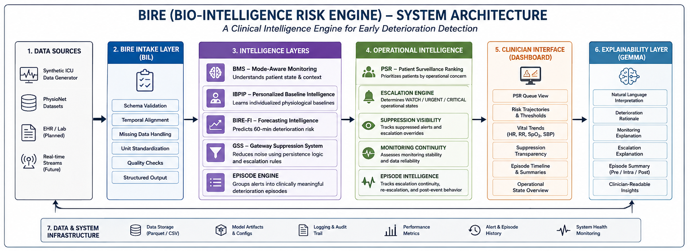
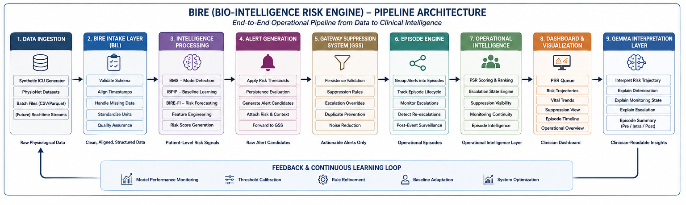
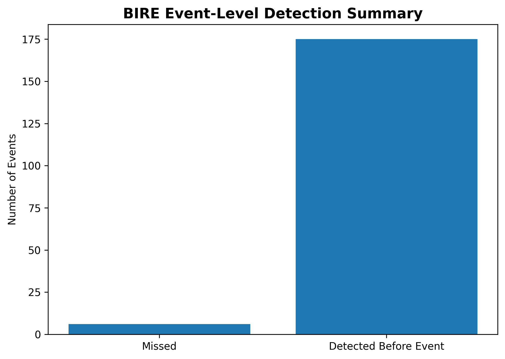
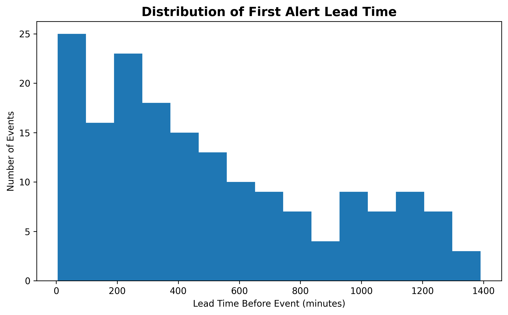
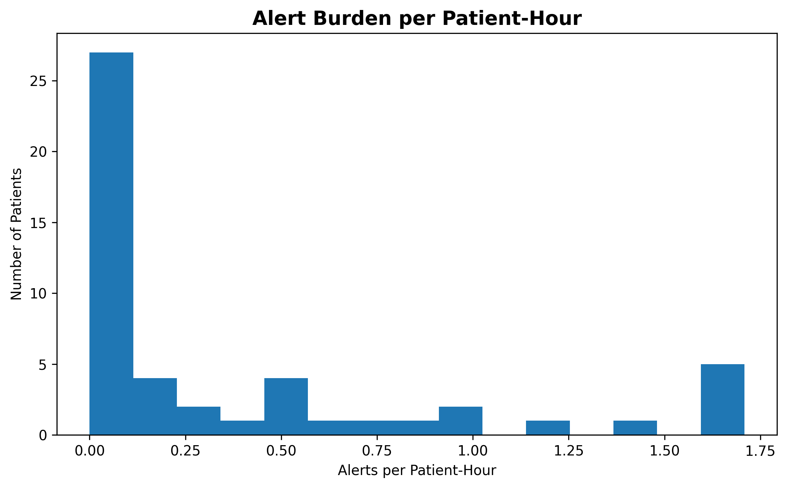
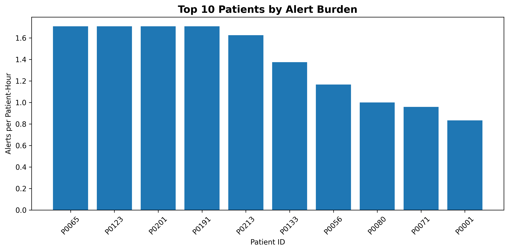

# 🧬 Project Sixth Sense — BIRE

### A Clinical Intelligence Engine for Early Deterioration Detection

> **We Detect What Others Miss.**
> *What happens next… starts quietly.*

---

# ⚠️ Research Prototype Disclaimer

BIRE is a research and educational prototype intended for:

* temporal intelligence research
* operational monitoring experimentation
* clinical deterioration forecasting exploration

BIRE is **NOT**:

* a medical device
* a diagnostic system
* a replacement for clinician judgment
* approved for clinical deployment

Synthetic ICU-style data is used for reproducible demonstration workflows.

---

#  What Is BIRE?

BIRE (**Bio-Intelligence Risk Engine**) is a time-series clinical intelligence system designed to detect patient deterioration **before it becomes clinically obvious**.

Unlike traditional monitoring systems that rely on static thresholds, BIRE analyzes:

* temporal physiological trends
* instability progression
* rate-of-change behavior
* deterioration trajectories
* operational monitoring states

to generate:

* forward-looking deterioration risk
* low-noise alert episodes
* operational escalation intelligence
* clinician-facing surveillance visibility

---

> **BIRE doesn’t ask:**
> “Is this abnormal right now?”

> **BIRE asks:**
> “Is this patient about to deteriorate?”

---
#  Stakeholder Summary

BIRE is an operational clinical intelligence prototype designed to detect patient deterioration before critical events occur.

The system combines:

- temporal machine learning
- operational alerting logic
- monitoring intelligence
- escalation tracking
- suppression transparency
- clinician-facing visualization

to improve early warning visibility while reducing unnecessary alert burden.

BIRE is designed around a core operational goal:

> identify meaningful deterioration earlier  
> while minimizing alarm fatigue.

The project evolved beyond a predictive model into a broader operational intelligence framework capable of:

- patient surveillance ranking
- episode-level monitoring
- operational escalation tracking
- deterioration trajectory visualization
- clinician-readable interpretation

Potential future applications include:

- ICU monitoring research
- clinical operations intelligence
- deterioration forecasting systems
- hospital monitoring workflow support
- explainable healthcare AI research

---
#  Clinical Philosophy

Traditional monitoring systems are often:

* reactive
* threshold-driven
* alarm-heavy
* difficult to interpret operationally

BIRE reframes monitoring from:

> **reactive threshold detection**

to:

> **proactive physiological intelligence**

The system is designed around the idea that deterioration is rarely caused by a single abnormal value.

Instead, deterioration emerges through:

* temporal instability
* physiological drift
* persistent worsening patterns
* escalation continuity across time

---

#  Intelligence Layers

BIRE evolved into a layered operational intelligence framework.

| Layer                    | Purpose                            |
| ------------------------ | ---------------------------------- |
| **BIL**                  | BIRE Intake Layer                  |
| **BMS**                  | Mode-aware monitoring logic        |
| **GSS**                  | Gateway Suppression System         |
| **IBPIP**                | Personalized baseline intelligence |
| **BIRE-FI**              | Forecasting intelligence           |
| **PSR**                  | Patient Surveillance Ranking       |
| **Gemma Interpretation** | Clinician-facing explanation layer |

---

#  System Architecture



---

#  Pipeline Architecture



---

# 📊 Results Snapshot

| Metric               | Value               |
| -------------------- | ------------------- |
| Event Detection Rate | **96.69%**          |
| Median Lead Time     | **405 minutes**     |
| Mean Alert Burden    | **0.372 alerts/hr** |
| Max Alert Burden     | **1.708 alerts/hr** |

---

#  BIRE Alerting Architecture

BIRE separates:

* Risk Prediction
* Alert Generation
* Alert Decision Logic
* Operational Monitoring
* Escalation Intelligence

The system uses the **Gateway Suppression System (GSS)** to ensure alerts remain:

* meaningful
* low-noise
* operationally interpretable
* clinically actionable

---

#  Event-Level Detection



---

#  Lead-Time Distribution



---

#  Alert Burden



---

#  High-Burden Patients



---

#  Operational Intelligence Dashboard

BIRE includes a clinician-facing operational monitoring dashboard designed to visualize:

* patient deterioration trajectories
* escalation transitions
* suppression transparency
* operational queue behavior
* episode intelligence
* monitoring continuity
* clinician-readable interpretation

---

##  Patient Surveillance Ranking (PSR)

The PSR system prioritizes operational concern across patients using:

* risk progression
* instability burden
* escalation continuity
* monitoring deterioration
* operational attention scoring

---

##  Operational Risk Trajectory

The operational trajectory layer visualizes:

* deterioration progression
* threshold transitions
* WATCH / URGENT / CRITICAL states
* episode behavior
* operational escalation continuity

---

##  Suppression Visibility

BIRE visualizes suppression behavior directly to improve:

* operational trust
* escalation transparency
* monitoring interpretability
* clinician reviewability

This allows reviewers to understand:

* what was suppressed
* why suppression occurred
* when escalation overrides activated

---

## ❤️ Vital Sign Monitoring

Vital trend monitoring visualizes:

* HR
* RR
* SpO2
* SBP

across deterioration timelines while aligning physiological changes with operational escalation behavior.

---

##  Operational Episode Intelligence

BIRE evaluates deterioration behavior as continuous operational episodes rather than isolated alerts.

Episode intelligence includes:

* escalation continuity
* suppression persistence
* re-escalation behavior
* monitoring transitions
* post-event surveillance

---

#  Gemma Clinical Interpretation Layer

BIRE includes an interpretation framework for clinician-facing operational summaries.

The interpretation layer is designed to provide:

* deterioration interpretation
* monitoring rationale
* escalation explanation
* post-event operational reasoning


Example outputs and screenshots remain included throughout the notebook.

---

#  Synthetic Dataset Support

BIRE includes a synthetic ICU-style data generator for reproducible experimentation.

Synthetic data generation is available through:

```text
src/bire/data/synthetic_icu_generator.py
```

No external clinical dataset is required to run the notebook.

---

#  BIL — BIRE Intake Layer

Chapter 26 introduces the:

**BIRE Intake Layer (BIL)**

which acts as the structured ingestion and validation framework for downstream intelligence systems.

BIL supports:

* temporal alignment
* schema validation
* operational formatting
* ingestion standardization

The ingestion framework also supports publicly accessible clinical research datasets, including PhysioNet-based workflows.

PhysioNet reference:

https://physionet.org/

---

#  Running The Project

## 1. Clone Repository

```bash
git clone https://github.com/zaychili07/ProjectSixthSenseV1.git
```

---

## 2. Install Requirements

```bash
pip install -r requirements.txt
```

---

## 3. Run Notebook

Run the primary notebook from top-to-bottom.

If synthetic data is missing, the notebook can generate it automatically.

---

## 4. Optional Gemma Integration

Gemma interpretation support is included in the project architecture.

For runtime stability during demonstration runs, live inference cells may remain disabled by default in the freeze notebook version.

---

#  Core Insight

> Early deterioration is not defined by a single abnormal reading,
> but by how physiology changes over time.

---

# 🔭 Future Development

Planned future expansion includes:

* multimodal intelligence
* EHR integration
* clinician verification workflows
* adaptive monitoring systems
* deployment infrastructure
* real-time streaming support
* advanced forecasting intelligence
* operational dashboard refinement

---

# Project Status:

BIRE has evolved from a hackathon prototype into an ongoing long-term operational intelligence research project focused on:

* temporal healthcare intelligence
* operational monitoring systems
* deterioration forecasting
* explainable monitoring intelligence
* low-noise clinical surveillance

---
